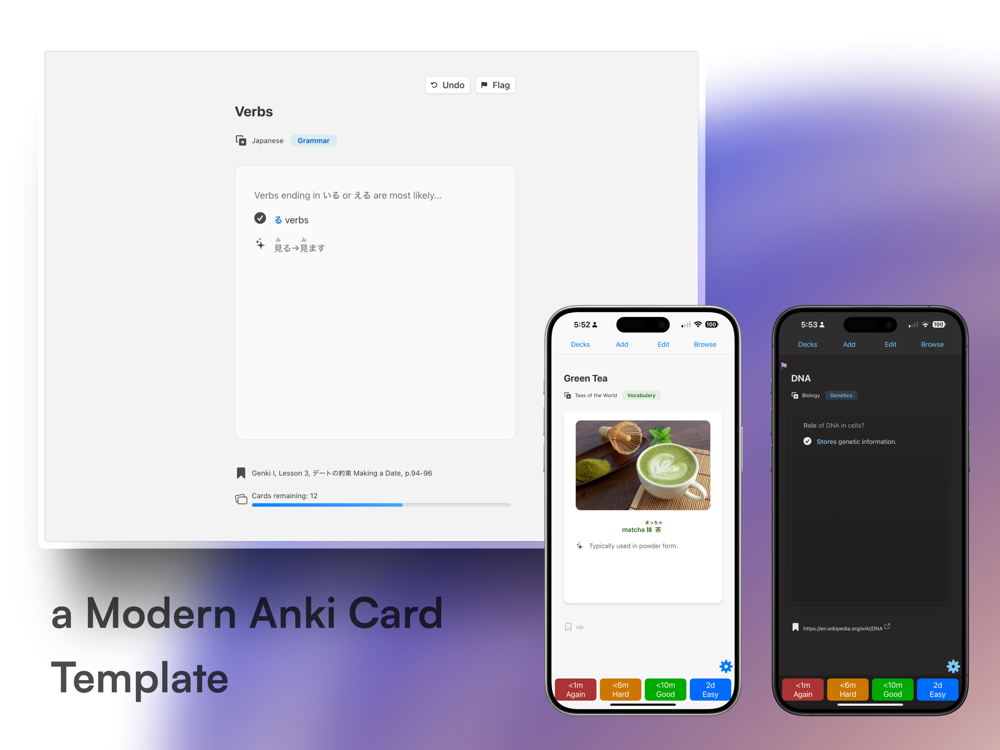

<h1 align="center">
  modern-anki-card-template
</h1>
<p align="center">
  A feature-rich, multi-platform Anki card template with major UI improvements.
  <br />
  <br />
  Includes both Q&A (front/back) and Cloze templates.
  <br />
  <br />
  <a href="#about">About</a>
  ·
  <a href="#installation">Installation</a>
  ·
  <a href="#features">Features</a>
  ·
  <a href="#usage">Usage</a>
</p>

<p align="center">
  
  
  
</p>

## About  
A modern, streamlined Anki template that enhances the default cards (**Front/Back, Cloze**) with better usability and design.  

It introduces new fields—**Topic, Subtopic, Source,** and **Details**—to help organize your cards more effectively.  

Common actions like **Undo** and **Flag** are also now built into the card interface, along with a **progress bar** for better tracking on Desktop.  

While many templates exist, few focus on a **native, built-in UI/UX experience**. This template bridges that gap.  

## Features

- 🌙🌞 **Dark and Light Mode**
- 🌍 Multi-language UI localisation (English, 日本語...)  
- 🔤 **Native Typography**  
  - 🖋️ System fonts  
  - 📱🖥️ Platform-specific typographic scale (iOS, Android, Desktop)  
- 🇯🇵 **Furigana and Japanese Text Support**  
  - 🔍 Correct typographic scaling  
- 🃏 **Flashcard Metadata**  
  - 📂 At a glance, see the deck your card belongs to
  - 🔗 Sources readily available without leaving card review
- 🖥️ **Better Desktop Interface**
  - 🔢 See the number of remaining cards
  - 📊 Progress bar built-in
  - 🚩 Check active flags at a glance
  - 🖱️ **Desktop UI Buttons**  
    - ⛳ Flag button  
    - ⏪ Undo button  
- 🎨 **Accent Colors**  
- 🎞️ **Subtle Animations**  
  - ✨ Smooth transitions for answer reveals  
- 🖥️📜 **Optional Code Syntax Highlighting**[^1]  


This card template was designed to be:
- Fast to make high-quality cards
- Fast to recall cards
- Fast to fix cards

## Installation

### Step 1: Install the Card Types 🃏  
1️⃣ **Download** the `.apkg` file from the Releases page.  
2️⃣ **Open the `.apkg` file & Import** the two card types using "Import Note Type":  
   - **Q&A**  
   - **Cloze**  

---

### Step 2: Install Required Add-ons 🔧  
To unlock all essential features, **install these add-ons via Anki's add-on menu**:  

```
1230570706 1490471827
```

> [!IMPORTANT]  
> 🚨 **These add-ons are required for full functionality on Desktop:**  
>  
> - 🔄 **Undo & Flag Status Buttons** → Requires **UI Status Buttons** `1230570706` add-on.  
> - 📊 **Remaining Cards & Progress Bar** → Requires **Anki JavaScript API** `1490471827` add-on.  

---

### Step 3 (Optional): Enable Code Syntax Highlighting 💻  
> [!NOTE]
> If you do not need to use code, skip this step.

By default, syntax highlighting is **disabled** to maximize performance.
To enable it:  

1️⃣ **Add these files** to your Anki `collection.media` folder:  
   - `_highlight.min.js`  
   - `_github-dark.min.css`  
   - **All files inside** `languages/`  

2️⃣ **Modify your card templates:**  
   - Find `syntaxHighlighting = false`  
   - Change it to `syntaxHighlighting = true`  
   - Apply this to the Front & Back sides of the templates you want to use  

📖 **For help finding the correct folder path, see** [Anki Docs](https://docs.ankiweb.net/files.html#file-locations).  

---

### ✅ That's it! You're all set! 🎉  
Now you can start using the deck with full functionality.  

### Useful extras

We've also curated 3 extra add-ons that make it extremely convenient to make cards.

- Editor Live Preview `1960039667`
- Field AutoComplete `511710206` 
- Markdown support for code blocks and inline code `1844938046`

If you _had_ to get an extra add-on, get **Editor Live Preview**. This visualises the cards you're making before committing.

To get all the extras, copy and paste this into your Anki Add-on menu:

```
511710206 1844938046 1960039667
```


## Add-on dependencies

### 1. UI Status Buttons
addon: `1230570706`

To use the UI buttons (Undo, Flag buttons) on Desktop, you'll need to download the add-on either from AnkiWeb, or within the Releases page.

### 2. Anki JavaScript API
addon: `1490471827` 

This is also a necessary add-on if you want to see how many remaining cards are in your deck during Card Review.

### 3. Editor Live Preview
addon: `1960039667` 

**This is the most recommended third-party addon.**

This card template was specially designed to reduce visual clutter and focus on the [Rule of Minimum Information](https://www.supermemo.com/en/blog/twenty-rules-of-formulating-knowledge#:~:text=cost%20you%20dearly!-,Stick%20to%20the%C2%A0minimum%20information%20principle,-The%20material%20you)[^2][^3]. When the container looks full, it's a good sign there's too much information in the card. The Live Preview helps you work with the design of the templates and structure your flashcard contents.

### 4. Field AutoComplete
addon: `511710206` 

If you find yourself often creating cards for the same topic, this is a lifesaver.

Used alongside the native pin function, you save 1+ minute per card.

### 5. Markdown support for code blocks and inline code
addon: `1844938046` 

If you need to use code blocks repeatedly, get this. 

It enables you to use double ticks for inline-code, `, and triple ticks for multi-line code blocks ts  with optional language support, i.e. ts for typescript, rs for rust, etc.

Note: You'll need to write your code blocks within the [HTML editor of Anki](https://docs.ankiweb.net/editing.html#:~:text=The%20%3C/%3E%20button%20allows%20editing%20the%20underlying%20HTML%20of%20a%20field.) (click the <> button in the Card Field to expand).

As of March 4 2025, `<>` tags are not supported while writing code blocks using this extension. 

## Usage

There are new fields to use:

| Fields                   |
|--------------------------|
| ✨ **Topic** 📌              |
| ✨ **Subtopic**  📌         |
| Question                 |
| Answer                   |
| ✨ **Source (optional)** 📌 |
| ✨ **Details (optional)** |

**Topic** represents the general thing you're studying, i.e. Vocabulary, Biology...

**Subtopic** represents a specific part of your topic, i.e. Colors, Plants...

**Source (optional)** allows you to cite a source,  usually your textbook or a URL

**Details (optional)** are any extra information that can help remember the card.

> [!TIP]
> By using Anki's built-in **pinned fields**📌 feature, you can efficiently create multiple flashcards for a topic and subtopic while keeping track of sources and context.
> 
> This is extremely useful if you were reading a chapter and needed to make flashcards for the same chapter.

Topic and Subtopic are flexible. The scope of **topics and subtopics** can expand or contract depending on how broadly or narrowly you define them.

Here’s a general hierarchy to illustrate:

1. **Genetics** (Broad Topic)  
   - **DNA** (Subtopic under Genetics)  
     - **mRNA** (Subtopic under DNA)  
       - **Transcription** (More specific subtopic under mRNA)

In Anki, this could be:  

| ✨ **Topic**    | **Genetics**  |
|----------|------|
| ✨ **Subtopic** | **DNA** |

or

| ✨ **Topic**    | **DNA**  |
|----------|------|
| ✨ **Subtopic** | **mRNA** |

The depth of the hierarchy depends on **how detailed you want to go** and what level of learning you're aiming for (e.g., high school, college, research).  

## FAQ
<details>
<summary> <b>Code highlighting doesn't seem to work</b></summary>
  
Be sure to add `_highlight.min.js`, `_github-dark.min.css` and all the files in `languages/` to your Anki's collection.media folder, then set syntaxHighlighting = true in your card templates.

For a visual guide on enabling syntax highlighting, check out the [Wiki page](https://github.com/tyuichis/modern-anki-card-template/wiki/Enabling-Syntax-Highlighting).
  
</details>

<details>
  <summary><b>What if I want to go back to my old template?</b></summary>
  
  Good news, these templates are backwards compatible. 
  
  In the browser menu, you can click a card and right click the "Change Note Type" option.

  The template fields map 1:1 with the original Anki cards, i.e. Front = Question, Back = Answer, and Cloze text = Cloze text.

> 
> If you have more than "Front" and "Back" fields, be careful. You will lose data if you don't select all the fields.
> Make a copy of your card first, then change the Note Type to test.
  
</details>

<details>
<summary> <b>[v1] My subject label is grayed out. What gives?</b></summary>
  
If your subject wasn't included in the defaults, you can manually add them. [See the wiki page for more information](https://github.com/tyuichis/modern-anki-card-template/wiki/Adding-new-subjects)
</details>

## Contributing / Building from Source

If you want to modify the templates, styles, or contribute to the project, you'll need to build the assets from the source files.

**Prerequisites:**

*   **Git:** To clone the repository.
*   **Node.js:** (Which includes npm) To manage dependencies and run build scripts. Download from [nodejs.org](https://nodejs.org/).

**Steps:**

1.  **Clone the Repository:**
    ```bash
    git clone https://github.com/tyuichis/modern-anki-card-template.git
    cd modern-anki-card-template
    ```

2.  **Install Dependencies:**
    ```bash
    npm install
    ```

3.  **Build Assets:**
    *   **Build only the EJS templates (HTML output):**
        ```bash
        npm run build:templates
        ```
        *(Output goes to the `build/` directory)*

    *   **Build only the CSS from SCSS:**
        ```bash
        npm run build:css:all
        ```
        *(Output goes to the `css/` directory)*

    *   **Build both CSS and Templates:**
        ```bash
        npm run build
        ```

4.  **Find the Output:**
    *   Generated HTML template files will be located in the `build/` directory, organized by language (e.g., `build/en/base/qna_front.html`).
    *   Generated CSS files will be located in the `css/` directory.

**Source Files:**

*   Edit EJS templates in the `templates/` directory.
*   Edit JavaScript modules in the `js/` directory.
*   Edit Sass/SCSS files in the `scss/` directory.
*   Edit translation strings in the `locales/` directory.
*   Add/modify SVG icons in the `icons/` directory.

After making changes to the source files, run the appropriate build command(s) again to see your changes reflected in the output directories.

## Support

If you find this card template helpful, consider supporting me! Your support helps keep development active.  

[](https://ko-fi.com/tyuichis)

<a href="https://www.buymeacoffee.com/tyuichis" target="_blank"></a>


## License

This project is licensed under the **GNU Affero General Public License v3.0 (AGPLv3)**.  

You are free to use, modify, and distribute this project, provided that:  

- Any modifications or derivative works must also be licensed under AGPLv3.  
- If you distribute this project (or a modified version) as a **hosted service** (e.g., on a website or cloud platform), you must also provide access to the full source code.  

For full details, see the [LICENSE](./LICENSE.md) file or read the full license text [here](https://www.gnu.org/licenses/agpl-3.0.html).  


[^1]: The card template is already coded to use highlight.js if available. Please put `_highlight.min.js` `_github-dark.min.css` and all the `languages/ files` to your Anki's `collection.media` folder, then set `syntaxHighlighting = true` in your card templates. Restart Anki to use.
[^2]: The flashcard text content has a container to help immediately focus on the information. The flashcard is also positioned such that the contents are where your eyes typically are, slightly above center.
[^3]: Metadata is still important to embed in a flashcard. For example, **sources** give reminders on where you learnt your knowledge and the memory associated with learning it.
