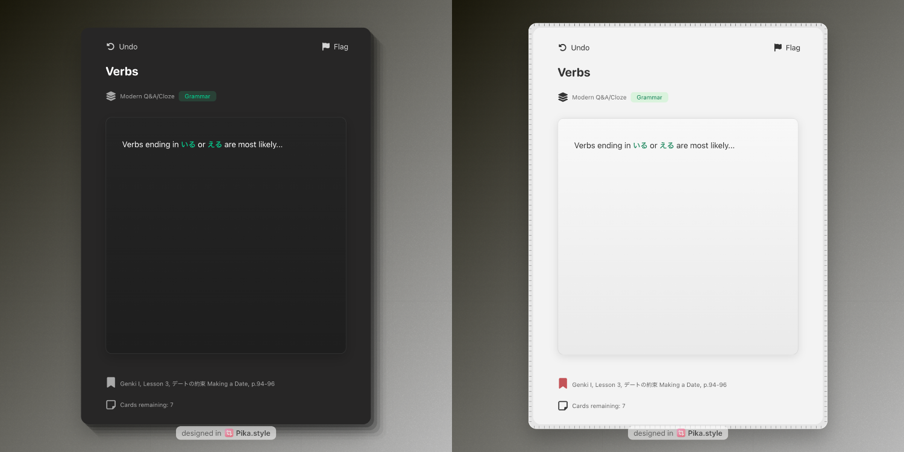

## modern-anki-card-template


[](https://ko-fi.com/tyuichis)

This Anki card template is built to be easy to use, beautifully consistent and feature-complete. It comes with a Q&A (typical front and back style cards) and Cloze template. While there are many templates out there, not many, if any, tried to engineer in a UI/UX experience that feels natively built-in.

## Key Features
- Dark and Light Mode support
- System fonts for a native feel
- Furigana and Japanese text support (with correct typographic scale)
- Flashcard Metadata: Easily view the Deck your card belongs to, the number of remaining cards, and any active flags at a glance.
- Desktop UI buttons: Flag and Undo buttons-- flag icon is colored when active.
- Variable accent color based on subject names
- Optional code syntax highlighting[^1]
- Accent color matches native Anki flag colors
- Subtle animations for answer reveals
- Near 'native' styling where possible, e.g., Material 3 color palette for Android
  
This card template was mainly produced and used on Mac and Android (Pixel). For any design or functionality tweaks on other platforms, such as Windows or Unix, please let me know.

This setup also avoids the bloat of excessive add-ons, but encourages using select add-ons where they genuinely enhance the card creation experience. Essentially, a somewhat vanilla experience wrapped with a thoughtful framework.

## Quick Start
Download the `.apkg` file from the Releases page, and click to open & import the two card types (Q&A, Cloze types)

✅ This is all you need to start. Though, not all features will be enabled:

- ✅ Essential styling and appearance
- ❌ the Undo and Flag status buttons won't work until the UI Status Buttons add-on is downloaded.
- ❌ the remaining cards text won't update properly until the Anki JavaScript API add-on is downloaded.
- ⚪ Optional: code highlighting is pre-configured, but requires `_highlight.js` and `_github-dark.min.css`. See below for instructions.
  
To get all of the core features working, you'll need to get UI Status Buttons (`1230570706`) and Anki JavaScript API (`1490471827`)

```
1230570706 1490471827
```

To download all the add-ons at once (including the recommended add-ons below), copy and paste this into your Anki Add-on menu:

```
1230570706 1490471827 511710206 1844938046 1960039667
```

⚠️ To enable Syntax Highlighting, please add `_highlight.min.js` `_github-dark.min.css` and all files inside `languages/` in your Anki's `collection.media` folder,
then change `syntaxHighlighting = false` to `syntaxHighlighting = true` in all of the Front and Back sides of the templates you want to use it on. 

For more details on the folder path, see [Anki Docs](https://docs.ankiweb.net/files.html#file-locations).

## Recommended add-ons

### 1. UI Status Buttons
addon: `1230570706`

To use the UI buttons (Undo, Flag buttons) on Desktop, you'll need to download the add-on either from AnkiWeb, or within the Releases page.

### 2. Anki JavaScript API
addon: `1490471827` 

This is also a necessary add-on if you want to see how many remaining cards are in your deck during Card Review.

### 3. Editor Live Preview
addon: `1960039667` 

**This is the most recommended third-party addon.**

This card template was specially designed to reduce visual clutter and focus on the [Rule of Minimum Information](https://www.supermemo.com/en/blog/twenty-rules-of-formulating-knowledge#:~:text=cost%20you%20dearly!-,Stick%20to%20the%C2%A0minimum%20information%20principle,-The%20material%20you)[^2][^3]. When the container looks full, it's a good sign there's too much information in the card. The Live Preview helps you work with the design of the templates and structure your flashcard contents.

### 4. Field AutoComplete
addon: `511710206` 

If you find yourself often creating cards for the same topic, this is a lifesaver.

Used alongside the native pin function, you save 1+ minute per card.

### 5. Markdown support for code blocks and inline code
addon: `1844938046` 

If you need to use code blocks repeatedly, get this. 

It enables you to use double ticks for inline-code, `, and triple ticks for multi-line code blocks ts  with optional language support, i.e. ts for typescript, rs for rust, etc.

Note: You'll need to write your code blocks within the [HTML editor of Anki](https://docs.ankiweb.net/editing.html#:~:text=The%20%3C/%3E%20button%20allows%20editing%20the%20underlying%20HTML%20of%20a%20field.) (click the <> button in the Card Field to expand).

As of March 4 2025, `<>` tags are not supported while writing code blocks using this extension. 

## FAQ
<details>
<summary> <b>My subject label is grayed out. What gives?</b></summary>
  
If your subject wasn't included in the defaults, you can manually add them.
The subjects included in the templates are starting points. In the HTML front and back side, you'll see:

```js
  var subjects = {
    algorithms: 'purple',
    python: 'turquoise',
    react: 'pink',
    kubernetes: 'green',
    rust: 'blue',
    'software testing': 'red',
    calculus: 'orange',
    grammar: 'green',
    'idioms and proverbs': 'pink',
    /* ... other subjects here */
  };
```

You can manually edit the key names to fit your subject names, but it's not recommended.

Instead, you can visit an AI chatbot and generate subject label colors this way.
Refer to the prompt located in [docs/generate-label-colors-prompt.txt](./docs/generate-label-colors-prompt.txt).

To do that with a chat bot, follow these steps:

1. Copy and paste the prompt and send.
2. Enter in the subjects you need to study. For example, in a Deck about Organic Chemistry:

```
nomenclature, reactions, mechanisms, stereochemistry, spectroscopy, synthesis, functional groups, reagents, acids and bases, resonance
```

3. You should get something like this structure back:
```js
var subjects = {
    "nomenclature": "purple",
    "reactions": "green",
    "mechanisms": "blue",
    "stereochemistry": "blue",
    "spectroscopy": "turquoise",
    "synthesis": "pink",
    "functional groups": "purple",
    "reagents": "turquoise",
    "acids and bases": "purple",
    "resonance": "blue"
}
```

4. Copy paste the new subject object (or part of it) into each of the card template's front and back side HTML. Ready to use!
</details>

<details>
<summary> <b>Code highlighting doesn't seem to work</b></summary>
  
Be sure to add `_highlight.js` and `_github-dark.min.css` to your Anki's `collection.media` folder.

For more details, see [https://docs.ankiweb.net/files.html#file-locations](https://docs.ankiweb.net/files.html#file-locations)
  
</details>

<details>
  <summary>What if I want to go back to my old template?</summary>
  Good news, these templates are **backwards-compatible**. In the browser menu, you can click a card and right click to find the "Change Note Type" option.

  The template fields map 1:1 with the original Anki cards, i.e. Front = Question, Back = Answer.

  Same with Cloze.
</details>

## Support

If you find this project helpful, consider supporting me on Ko-Fi! Your support helps keep development active.  

[](https://ko-fi.com/tyuichis)


## License

This project is licensed under the **GNU Affero General Public License v3.0 (AGPLv3)**.  

You are free to use, modify, and distribute this project, provided that:  

- Any modifications or derivative works must also be licensed under AGPLv3.  
- If you distribute this project (or a modified version) as a **hosted service** (e.g., on a website or cloud platform), you must also provide access to the full source code.  

For full details, see the [LICENSE](./LICENSE.md) file or read the full license text [here](https://www.gnu.org/licenses/agpl-3.0.html).  


[^1]: The card template is already coded to use highlight.js if available. Please put `_highlight.js` and any theme (default, `_github-dark.min.css` in `collection.media` then restart Anki to use.
[^2]: The flashcard text content has a container to help immediately focus on the information. The flashcard is also positioned such that the contents are where your eyes typically are, slightly above center.
[^3]: Metadata is still important to embed in a flashcard. For example, **sources** give reminders on where you learnt your knowledge and the memory associated with learning it.
