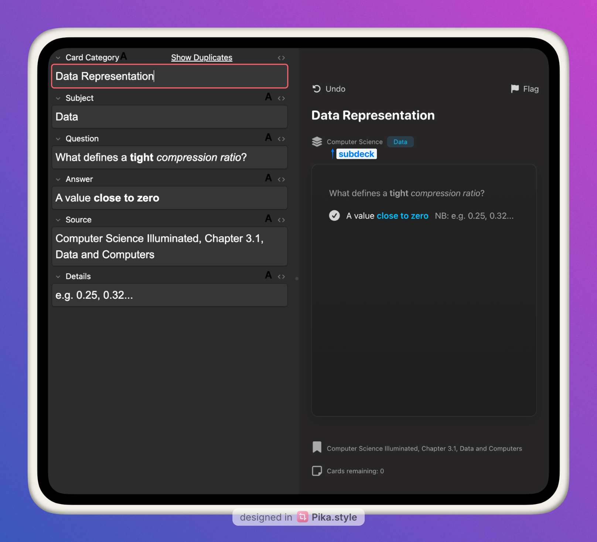

## modern-anki-card-template


[](https://ko-fi.com/tyuichis)

### Mobile Preview

<details>
  <summary>Mobile preview (Click to expand)</summary>
  
  

</details>

This Anki card template is built to be easy to use, beautifully consistent and feature-complete. It comes with a Q&A (typical front and back style cards) and Cloze template. While there are many templates out there, not many, if any, tried to engineer in a UI/UX experience that feels natively built-in.

## An Enhanced Vanilla Anki Framework

Anki’s default card types—**Basic Note** and **Cloze Note**—are simple and effective.  
However, they lack structure, making it harder to organize information efficiently.  

### **The Problem**  
- What should we write in each field?
- How _much_ information should we have? 
- How do we categorize cards for better review?  
- In a mixed deck with many subdecks, how do we know where each card belongs?  
- How do we remember where we got the information?  

To solve these issues, we introduced a **structured framework** with additional fields.

---

### **The Improved Note Types**

#### **Basic Note → Modern Q&A**
| Default Field | Improved Field Name |
|---------------|---------------------|
|               | **Card Category**   |
|               | **Subject**         |
| Front         | **Question**        |
| Back          | **Answer**          |
|               | **Source**          |
|               | **Details**         |


#### **Cloze Note → Modern Cloze**
| Default Field | Improved Field Name |
|---------------|---------------------|
|               | **Card Category**   |
|               | **Subject**         |
| Text          | **Cloze Text**      |
|               | **Source**          |
| Back Extra    | **Details**         |


🔹 **New fields added:**  
- **Card Category** (subtopic)  
- **Subject** (main topic)  
- **Source** (where the information came from)  
- **Details** (extra explanations, if needed)  

---

### **Example: Computer Science Flashcard**

| Field                | Basic Note Type                         | Modern Q&A Note Type                                            |
|----------------------|-----------------------------------------|-----------------------------------------------------------------|
| **Card Category**📌  |                                         | Data Representation                                             |
| **Subject**📌        |                                         | Data                                                            |
| **Front → Question** | What defines a tight compression ratio? | What defines a tight compression ratio?                         |
| **Back → Answer**    | A value close to zero                   | A value close to zero                                           |
| **Source**📌         |                                         | *Computer Science Illuminated, Chapter 3.1, Data and Computers* |
| **Details**          |                                         | e.g. 0.25, 0.32...                                              |

<details>
  <summary>Card preview (Click to expand)</summary>
  
  

</details>

With these improvements, each card is now **self-contained and informative**.  

This structure makes it easy to create high-quality flashcards with inherent links to one another.

> [!TIP]
> By using Anki's built-in **pinned fields**📌 feature, you can efficiently create multiple flashcards for a topic while keeping track of sources and context.
> 
> This is extremely useful if you were reading a chapter and needed to make flashcards for the same chapter.

This approach to flashcards creating cards **more intuitive**, helps with **memory recall**, and ensures you can revisit and refine problematic cards easily.

## Key Features
- Dark and Light Mode support
- System fonts for a native feel
- Furigana and Japanese text support (with correct typographic scale)
- Flashcard Metadata: Easily view the Deck your card belongs to, the number of remaining cards, and any active flags at a glance.
- Desktop UI buttons: Flag and Undo buttons-- flag icon is colored when active.
- Variable accent color based on subject names
- Optional code syntax highlighting[^1]
- Accent color matches native Anki flag colors
- Subtle animations for answer reveals
- Near 'native' styling where possible, e.g., Material 3 color palette for Android

This card template was designed to be:
- Fast to make high-quality cards
- Fast to recall cards
- Fast to fix cards

It also avoids the bloat of excessive add-ons, but encourages select add-ons which makes card creation a lot more efficient, such as Editor Live Preview and Field AutoComplete.

> [!NOTE]
> This card template was mainly produced and used on Mac and Android (Pixel). For any design or functionality tweaks on other platforms, such as Windows or Unix, please let me know.

## Quick Start
Download the `.apkg` file from the Releases page, and click to open & import the two card types (Q&A, Cloze types)

✅ This is all you need to start. 

> [!IMPORTANT]
> Not all features will be enabled:
> 
> - ✅ **Essential styling and appearance** will work.
> - ❌ **Undo and Flag status buttons** won't work until the UI Status Buttons add-on is downloaded.
> - ❌ **Remaining cards text** won't update properly until the Anki JavaScript API add-on is downloaded.
> - ⚪ **Optional**: Code highlighting is pre-configured, but requires `_highlight.min.js` and `_github-dark.min.css`. See below for instructions.
  
To get all of the core features working, you'll need to get UI Status Buttons (`1230570706`) and Anki JavaScript API (`1490471827`)

```
1230570706 1490471827
```

To download all the add-ons at once (including the recommended add-ons below), copy and paste this into your Anki Add-on menu:

```
1230570706 1490471827 511710206 1844938046 1960039667
```

> [!NOTE]
> To enable Syntax Highlighting, please add `_highlight.min.js`, `_github-dark.min.css` and all files inside `languages/` in your Anki's `collection.media` folder,
then change `syntaxHighlighting = false` to `syntaxHighlighting = true` in all of the Front and Back sides of the templates you want to use it on. 
>
> By default, it's not turned on to maximise performance.
> 
> For more details on the folder path, see [Anki Docs](https://docs.ankiweb.net/files.html#file-locations).

## Recommended add-ons

### 1. UI Status Buttons
addon: `1230570706`

To use the UI buttons (Undo, Flag buttons) on Desktop, you'll need to download the add-on either from AnkiWeb, or within the Releases page.

### 2. Anki JavaScript API
addon: `1490471827` 

This is also a necessary add-on if you want to see how many remaining cards are in your deck during Card Review.

### 3. Editor Live Preview
addon: `1960039667` 

**This is the most recommended third-party addon.**

This card template was specially designed to reduce visual clutter and focus on the [Rule of Minimum Information](https://www.supermemo.com/en/blog/twenty-rules-of-formulating-knowledge#:~:text=cost%20you%20dearly!-,Stick%20to%20the%C2%A0minimum%20information%20principle,-The%20material%20you)[^2][^3]. When the container looks full, it's a good sign there's too much information in the card. The Live Preview helps you work with the design of the templates and structure your flashcard contents.

### 4. Field AutoComplete
addon: `511710206` 

If you find yourself often creating cards for the same topic, this is a lifesaver.

Used alongside the native pin function, you save 1+ minute per card.

### 5. Markdown support for code blocks and inline code
addon: `1844938046` 

If you need to use code blocks repeatedly, get this. 

It enables you to use double ticks for inline-code, `, and triple ticks for multi-line code blocks ts  with optional language support, i.e. ts for typescript, rs for rust, etc.

Note: You'll need to write your code blocks within the [HTML editor of Anki](https://docs.ankiweb.net/editing.html#:~:text=The%20%3C/%3E%20button%20allows%20editing%20the%20underlying%20HTML%20of%20a%20field.) (click the <> button in the Card Field to expand).

As of March 4 2025, `<>` tags are not supported while writing code blocks using this extension. 

## FAQ
<details>
<summary> <b>My subject label is grayed out. What gives?</b></summary>
  
If your subject wasn't included in the defaults, you can manually add them. [See the wiki page for more information](https://github.com/tyuichis/modern-anki-card-template/wiki/Adding-new-subjects)
</details>

<details>
<summary> <b>Code highlighting doesn't seem to work</b></summary>
  
Be sure to add _highlight.min.js _github-dark.min.css and all the languages/ files to your Anki's collection.media folder, then set syntaxHighlighting = true in your card templates.

For a visual guide on enabling syntax highlighting, check out the [Wiki page](https://github.com/tyuichis/modern-anki-card-template/wiki/Enabling-Syntax-Highlighting).
  
</details>

<details>
  <summary><b>What if I want to go back to my old template?</b></summary>
  
  Good news, these templates are backwards compatible. 
  
  In the browser menu, you can click a card and right click the "Change Note Type" option.

  The template fields map 1:1 with the original Anki cards, i.e. Front = Question, Back = Answer, and Cloze text = Cloze text.

> [!WARNING]
> If you have more than "Front" and "Back" fields, be careful. You will lose data if you don't select all the fields.
> Make a copy of your card first, then change the Note Type to test.
  
</details>

## Support

If you find this project helpful, consider supporting me on Ko-Fi! Your support helps keep development active.  

[](https://ko-fi.com/tyuichis)


## License

This project is licensed under the **GNU Affero General Public License v3.0 (AGPLv3)**.  

You are free to use, modify, and distribute this project, provided that:  

- Any modifications or derivative works must also be licensed under AGPLv3.  
- If you distribute this project (or a modified version) as a **hosted service** (e.g., on a website or cloud platform), you must also provide access to the full source code.  

For full details, see the [LICENSE](./LICENSE.md) file or read the full license text [here](https://www.gnu.org/licenses/agpl-3.0.html).  


[^1]: The card template is already coded to use highlight.js if available. Please put `_highlight.min.js` `_github-dark.min.css` and all the `languages/ files` to your Anki's `collection.media` folder, then set `syntaxHighlighting = true` in your card templates. Restart Anki to use.
[^2]: The flashcard text content has a container to help immediately focus on the information. The flashcard is also positioned such that the contents are where your eyes typically are, slightly above center.
[^3]: Metadata is still important to embed in a flashcard. For example, **sources** give reminders on where you learnt your knowledge and the memory associated with learning it.
